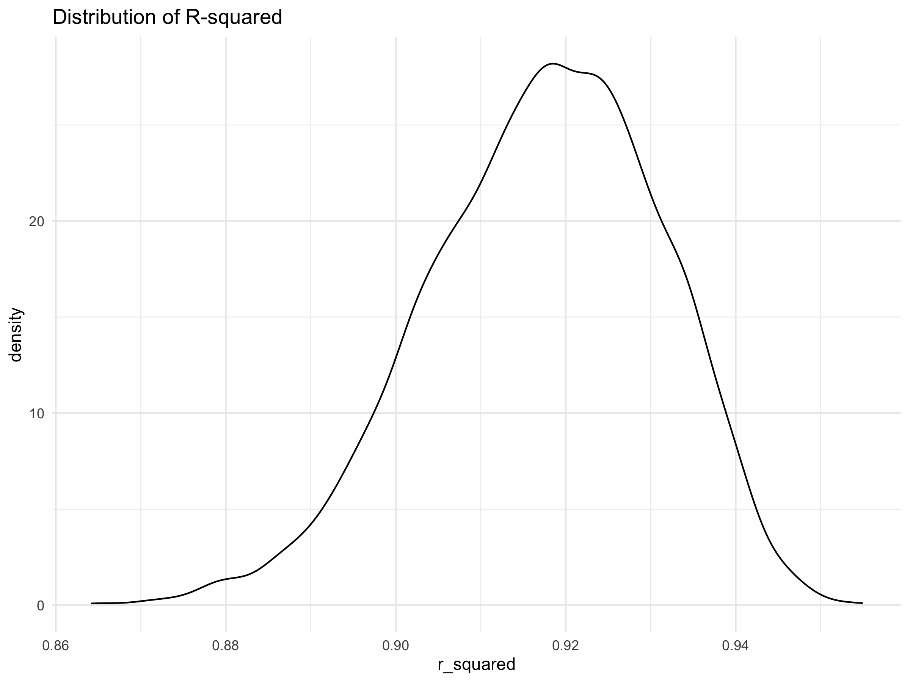

p8105_hw6_yh3676
================
Yuzhe Hu
2023-12-02

### Problem 1

In the data cleaning code below we create a `city_state` variable,
change `victim_age` to numeric, modifiy victim_race to have categories
white and non-white, with white as the reference category, and create a
`resolution` variable indicating whether the homicide is solved. Lastly,
we filtered out the following cities: Tulsa, AL; Dallas, TX; Phoenix,
AZ; and Kansas City, MO; and we retained only the variables
`city_state`, `resolution`, `victim_age`, `victim_sex`, and
`victim_race`.

``` r
homicide_df = 
  read_csv("data/homicide-data.csv", na = c("", "NA", "Unknown")) |> 
  mutate(
    city_state = str_c(city, state, sep = ", "),
    victim_age = as.numeric(victim_age),
    resolution = case_when(
      disposition == "Closed without arrest" ~ 0,
      disposition == "Open/No arrest"        ~ 0,
      disposition == "Closed by arrest"      ~ 1)
  ) |> 
  filter(victim_race %in% c("White", "Black")) |> 
  filter(!(city_state %in% c("Tulsa, AL", "Dallas, TX", "Phoenix, AZ", "Kansas City, MO"))) |> 
  select(city_state, resolution, victim_age, victim_sex, victim_race)
```

Next we fit a logistic regression model using only data from Baltimore,
MD. We model `resolved` as the outcome and `victim_age`, `victim_sex`,
and `victim_race` as predictors. We save the output as `baltimore_glm`
so that we can apply `broom::tidy` to this object and obtain the
estimate and confidence interval of the adjusted odds ratio for solving
homicides comparing non-white victims to white victims.

``` r
baltimore_glm = 
  filter(homicide_df, city_state == "Baltimore, MD") |> 
  glm(resolution ~ victim_age + victim_sex + victim_race, family = binomial(), data = _)

baltimore_glm |> 
  broom::tidy() |> 
  mutate(
    OR = exp(estimate), 
    OR_CI_upper = exp(estimate + 1.96 * std.error),
    OR_CI_lower = exp(estimate - 1.96 * std.error)) |> 
  filter(term == "victim_sexMale") |> 
  select(OR, OR_CI_lower, OR_CI_upper) |>
  knitr::kable(digits = 3)
```

|    OR | OR_CI_lower | OR_CI_upper |
|------:|------------:|------------:|
| 0.426 |       0.325 |       0.558 |

Below, by incorporating `nest()`, `map()`, and `unnest()` into the
preceding Baltimore-specific code, we fit a model for each of the
cities, and extract the adjusted odds ratio (and CI) for solving
homicides comparing non-white victims to white victims. We show the
first 5 rows of the resulting dataframe of model results.

``` r
model_results = 
  homicide_df |> 
  nest(data = -city_state) |> 
  mutate(
    models = map(data, \(df) glm(resolution ~ victim_age + victim_sex + victim_race, 
                             family = binomial(), data = df)),
    tidy_models = map(models, broom::tidy)) |> 
  select(-models, -data) |> 
  unnest(cols = tidy_models) |> 
  mutate(
    OR = exp(estimate), 
    OR_CI_upper = exp(estimate + 1.96 * std.error),
    OR_CI_lower = exp(estimate - 1.96 * std.error)) |> 
  filter(term == "victim_sexMale") |> 
  select(city_state, OR, OR_CI_lower, OR_CI_upper)

model_results |>
  slice(1:5) |> 
  knitr::kable(digits = 3)
```

| city_state      |    OR | OR_CI_lower | OR_CI_upper |
|:----------------|------:|------------:|------------:|
| Albuquerque, NM | 1.767 |       0.831 |       3.761 |
| Atlanta, GA     | 1.000 |       0.684 |       1.463 |
| Baltimore, MD   | 0.426 |       0.325 |       0.558 |
| Baton Rouge, LA | 0.381 |       0.209 |       0.695 |
| Birmingham, AL  | 0.870 |       0.574 |       1.318 |

Below we generate a plot of the estimated ORs and CIs for each city,
ordered by magnitude of the OR from smallest to largest. From this plot
we see that most cities have odds ratios that are smaller than 1,
suggesting that crimes with male victims have smaller odds of resolution
compared to crimes with female victims after adjusting for victim age
and race. This disparity is strongest in New yrok. In roughly half of
these cities, confidence intervals are narrow and do not contain 1,
suggesting a significant difference in resolution rates by sex after
adjustment for victim age and race.

``` r
model_results |> 
  mutate(city_state = fct_reorder(city_state, OR)) |> 
  ggplot(aes(x = city_state, y = OR)) + 
  geom_point() + 
  geom_errorbar(aes(ymin = OR_CI_lower, ymax = OR_CI_upper)) + 
  theme(axis.text.x = element_text(angle = 90, hjust = 1))
```


### Problem 2

Here we will focus on a simple linear regression with `tmax` as the
response with `tmin` and `prcp` as the predictors, and are interested in
the distribution of two quantities estimated : $\hat{r}^2$ and
$log (\hat{β}_1 * \hat{β}_2)$. Use 5000 bootstrap samples and, for each
bootstrap sample, produce estimates of these two quantities.

``` r
#import data
weather_df = 
  rnoaa::meteo_pull_monitors(
    c("USW00094728"),
    var = c("PRCP", "TMIN", "TMAX"), 
    date_min = "2022-01-01",
    date_max = "2022-12-31") |>
  mutate(
    name = recode(id, USW00094728 = "CentralPark_NY"),
    tmin = tmin / 10,
    tmax = tmax / 10) |>
  select(name, id, everything())
```

Generate 5000 bootstrap samples

``` r
# bootstrap function
boot_sample = function(df) {
  
  sample_frac(df, replace = TRUE) 
  
}
# draw the 5000 samples
boot_straps =
  tibble(strap_number = 1:5000) |>
  mutate(
    strap_sample = map(strap_number, \(i) boot_sample(weather_df))
  )
```

Fit the linear regression model

``` r
boot_results =
  boot_straps |>
  mutate(
    # map each sample to lm() to get linear models
    models = map(strap_sample, \(df) lm(tmax ~ tmin + prcp, data = df)), 
    glance = map(models, broom::glance),
    results = map(models, broom::tidy),
    r_squared = map(glance, \(df) pull(df, r.squared)),
    log_b1b2 = map(results, \(df) log(abs(df$estimate[2] * df$estimate[3])))
  ) |>
  select(strap_number, r_squared, log_b1b2) |>
  mutate(
    r_squared = as.numeric(r_squared),
    log_b1b2 = as.numeric(log_b1b2)
  )
```

Plot the estimates

``` r
#plot the distribution of r-squared
boot_results |>
  ggplot(aes(x = r_squared)) +
  geom_density() +
  labs(title = "Distribution of R-squared")
```



- The $\hat{r}^2$ distribution is centered around 0.92, and most of the
  $\hat{r}^2$ values exceed 0.85, which means the current model with
  `tmin` and `prcp` as the predictors explains a large proportion of the
  variance in the response variable `tmax`.

``` r
#plot the distribution of log(beta1_hat * beta2_hat)
boot_results |>
  ggplot(aes(x = log_b1b2)) +
  geom_density() +
  labs(title = "Distribution of log(beta1_hat * beta2_hat)")
```


- The $log (\hat{β}_1 * \hat{β}_2)$ distribution is centered around -5
  but left-skewed.This might because many outliers are included in the
  bootstrap sample.

Provide 95% confidence interval for $\hat{r}^2$ and
$log (\hat{β}_1 * \hat{β}_2)$ using 5000 bootstrap samples

``` r
# CI for R_square
boot_results |>
  summarize(
    R_squared_CI_lower = quantile(r_squared, 0.025),
    R_squared_CI_upper = quantile(r_squared, 0.975)) |>
  knitr::kable(digits = 3)
```

| R_squared_CI_lower | R_squared_CI_upper |
|-------------------:|-------------------:|
|              0.889 |              0.941 |

``` r
# CI for log(beta1_hat * beta2_hat)
boot_results |>
  summarize(
    log_b1b2_CI_lower = quantile(log_b1b2, 0.025),
    log_b1b2_CI_upper = quantile(log_b1b2, 0.975)) |>
  knitr::kable(digits = 3)
```

| log_b1b2_CI_lower | log_b1b2_CI_upper |
|------------------:|------------------:|
|            -8.653 |            -4.591 |

### Problem 3

Load and clean the data for regression analysis (i.e. convert numeric to
factor where appropriate, check for missing data, etc.)

``` r
# import data 
birthwt_df = 
  read_csv("data/birthweight.csv") |>
  janitor::clean_names() |>
  #convert some variables' type into factor
  mutate(babysex = as.factor(babysex),
         frace = as.factor(frace),
         malform = as.factor(malform),
         mrace = as.factor(mrace)) |>
  select(bwt,everything())
```

``` r
# check for missing data
is.na(birthwt_df) |> 
  colSums() 
```

    ##      bwt  babysex    bhead  blength    delwt  fincome    frace  gaweeks 
    ##        0        0        0        0        0        0        0        0 
    ##  malform menarche  mheight   momage    mrace   parity  pnumlbw  pnumsga 
    ##        0        0        0        0        0        0        0        0 
    ##    ppbmi     ppwt   smoken   wtgain 
    ##        0        0        0        0

``` r
  # there is no missing data
```

First, establish a linear regression model with birthweight as the
response variable, and use all the other variables as covariates.

``` r
full_fit = lm(bwt ~., data = birthwt_df) 
broom::tidy(full_fit) |> 
  knitr::kable()
```

| term        |      estimate |   std.error |  statistic |   p.value |
|:------------|--------------:|------------:|-----------:|----------:|
| (Intercept) | -6265.3914076 | 660.4010631 | -9.4872522 | 0.0000000 |
| babysex2    |    28.7073088 |   8.4652447 |  3.3911966 | 0.0007021 |
| bhead       |   130.7781455 |   3.4523248 | 37.8811826 | 0.0000000 |
| blength     |    74.9535780 |   2.0216656 | 37.0751613 | 0.0000000 |
| delwt       |     4.1007326 |   0.3948202 | 10.3863301 | 0.0000000 |
| fincome     |     0.2898207 |   0.1795416 |  1.6142265 | 0.1065513 |
| frace2      |    14.3312853 |  46.1501283 |  0.3105362 | 0.7561682 |
| frace3      |    21.2361118 |  69.2959907 |  0.3064551 | 0.7592729 |
| frace4      |   -46.9962310 |  44.6782159 | -1.0518824 | 0.2929123 |
| frace8      |     4.2969242 |  74.0740827 |  0.0580085 | 0.9537446 |
| gaweeks     |    11.5493872 |   1.4653680 |  7.8815609 | 0.0000000 |
| malform1    |     9.7649680 |  70.6258929 |  0.1382633 | 0.8900388 |
| menarche    |    -3.5507723 |   2.8950777 | -1.2264860 | 0.2200827 |
| mheight     |     9.7874130 |  10.3115672 |  0.9491683 | 0.3425881 |
| momage      |     0.7593479 |   1.2221417 |  0.6213256 | 0.5344182 |
| mrace2      |  -151.4354038 |  46.0453432 | -3.2888321 | 0.0010141 |
| mrace3      |   -91.3866079 |  71.9189677 | -1.2706885 | 0.2039079 |
| mrace4      |   -56.4787268 |  45.1368828 | -1.2512766 | 0.2109013 |
| parity      |    95.5411137 |  40.4792711 |  2.3602479 | 0.0183069 |
| pnumlbw     |            NA |          NA |         NA |        NA |
| pnumsga     |            NA |          NA |         NA |        NA |
| ppbmi       |     4.3537865 |  14.8913292 |  0.2923706 | 0.7700173 |
| ppwt        |    -3.4715550 |   2.6121254 | -1.3290155 | 0.1839131 |
| smoken      |    -4.8543629 |   0.5870549 | -8.2690107 | 0.0000000 |
| wtgain      |            NA |          NA |         NA |        NA |

Then, select predictors through the backward stepwise method.

``` r
stepwise_model = MASS::stepAIC(full_fit, trace = FALSE, direction = "backward")
broom::tidy(stepwise_model) |> 
  knitr::kable()
```

| term        |      estimate |   std.error |  statistic |   p.value |
|:------------|--------------:|------------:|-----------:|----------:|
| (Intercept) | -6098.8219113 | 137.5463421 | -44.340124 | 0.0000000 |
| babysex2    |    28.5580171 |   8.4548958 |   3.377690 | 0.0007374 |
| bhead       |   130.7770408 |   3.4465672 |  37.944144 | 0.0000000 |
| blength     |    74.9471109 |   2.0190479 |  37.120027 | 0.0000000 |
| delwt       |     4.1067316 |   0.3920592 |  10.474775 | 0.0000000 |
| fincome     |     0.3180229 |   0.1747477 |   1.819898 | 0.0688436 |
| gaweeks     |    11.5924873 |   1.4620657 |   7.928842 | 0.0000000 |
| mheight     |     6.5940377 |   1.7848817 |   3.694383 | 0.0002231 |
| mrace2      |  -138.7924801 |   9.9070869 | -14.009414 | 0.0000000 |
| mrace3      |   -74.8867755 |  42.3146313 |  -1.769761 | 0.0768374 |
| mrace4      |  -100.6781427 |  19.3246910 |  -5.209819 | 0.0000002 |
| parity      |    96.3046933 |  40.3362158 |   2.387549 | 0.0170038 |
| ppwt        |    -2.6755853 |   0.4273585 |  -6.260752 | 0.0000000 |
| smoken      |    -4.8434197 |   0.5855757 |  -8.271210 | 0.0000000 |

- The selected predictors are: `babysex`, `bhead`, `blength`, `delwt`,
  `fincome`, `gaweeks`, `mheight`, `mrace`, `parity`, `ppwt`, `smoken`.

Plot of model residuals against fitted value.

``` r
birthwt_df |>
  add_predictions(stepwise_model) |>
  add_residuals(stepwise_model) |>
  ggplot(aes(x = pred, y = resid)) + 
  geom_point() +
  labs(title = "Residuals vs Fitted Values ") + 
  xlab("Fitted Values") + 
  ylab("Residuals")
```


Then compare `my model` to two others and make this comparison in terms
of the cross-validated prediction error.

- Model 1: use length at birth and gestational age as predictors (main
  effects only).

- Model 2: use head circumference, length, sex, and all interactions
  (including the three-way interaction) between these.

To be specific, the three models will have the following form as:

- my_model: lm(bwt ~ babysex + bhead + blength + delwt + fincome +
  gaweeks + mheight + mrace + parity + ppwt + smoken)

- model_1: lm(bwt ~ blength + gaweeks)

- model_2: lm(bwt ~ bhead \* blength \* babysex)

``` r
cv_df = 
  crossv_mc(birthwt_df, 100) |>
  mutate(
    train = map(train, as.tibble),
    test = map(test, as.tibble)
  )
```

``` r
outcome =
cv_df |>
  mutate(
    my_model = map(train, ~lm(bwt ~ babysex + bhead + blength + delwt + fincome + gaweeks + mheight + mrace + parity + ppwt + smoken, data = birthwt_df)),
    model_1 = map(train, ~lm(bwt ~ blength + gaweeks, data = birthwt_df)),
    model_2 = map(train, ~lm(bwt ~ bhead * blength * babysex, data = birthwt_df))
  ) |>
  mutate(
    rmse_my_model = map2_dbl(my_model, test, \(mod, df) rmse(model = mod, data = df)),
    rmse_1 = map2_dbl(model_1, test, \(mod, df) rmse(model = mod, data = df)),
    rmse_2 = map2_dbl(model_2, test, \(mod, df) rmse(model = mod, data = df))
  ) 

outcome |>
  summarize(
    mean_rmse_my_model = mean(rmse_my_model),
    mean_rmse_1 = mean(rmse_1),
    mean_rmse_2 = mean(rmse_2)
  ) |>
  knitr::kable()
```

| mean_rmse_my_model | mean_rmse_1 | mean_rmse_2 |
|-------------------:|------------:|------------:|
|           272.7251 |    334.2275 |    288.4057 |

``` r
outcome |>
  select(starts_with("rmse")) |> 
  pivot_longer(
    everything(),
    names_to = "model", 
    values_to = "rmse",
    names_prefix = "rmse_") |> 
  mutate(model = fct_inorder(model)) |> 
  ggplot(aes(x = model, y = rmse)) + 
  geom_violin(aes(fill = model)) +
  labs(
    title = "Violin plot of RMSE of the models "
  )
```


- This violin plot provides a visual comparison of the RMSE distribution
  across the three different models that established previously. To
  determine the superior model, the criterion we adapted here is
  selecting the model that demonstrates lower RMSE values consistently
  across different cross-validation folds. According to the graph,
  `my model` has lower RSME on average compared to `model 1` and
  `model 2`, suggesting that `my model` has the best predictive accuracy
  among the three models.
